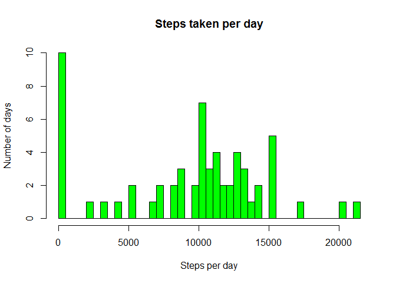
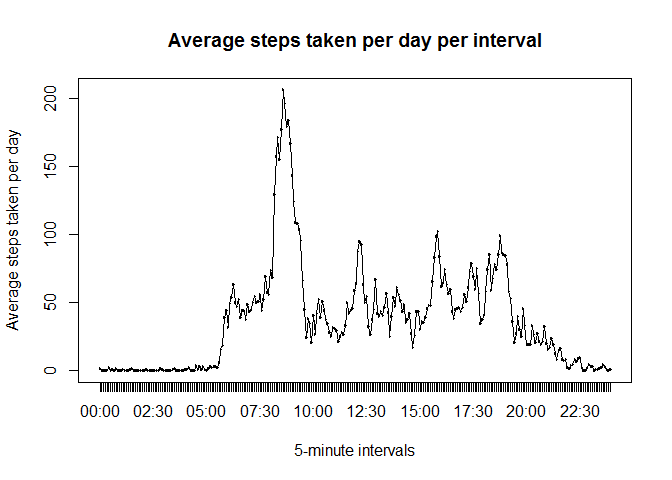
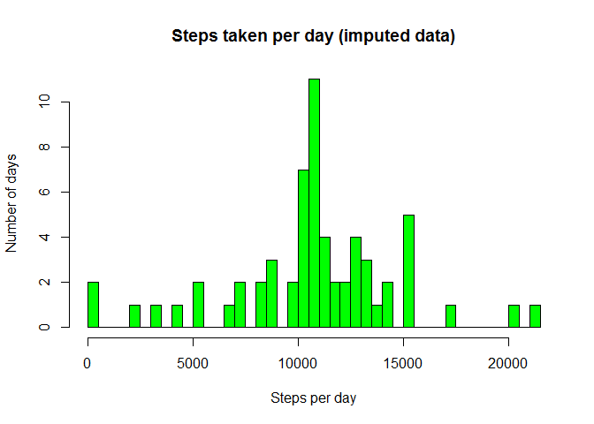
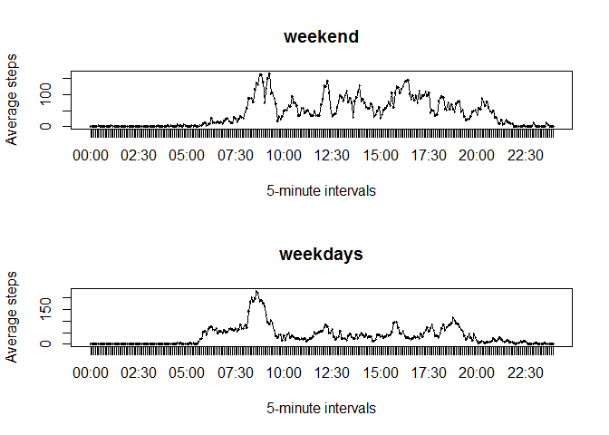

## Loading and preprocessing the data

```r
knitr::opts_chunk$set(
  fig.path = "figure/"
)
options(scipen=999)
library(dplyr)
library(readr)
data <- read_csv(unzip("activity.zip"))
data$interval <- paste0((data$interval%/%100),":",(data$interval%%100))
data$interval <- format(strptime(data$interval, format="%H:%M"), format="%H:%M")
data$interval <- as.factor(data$interval)
```
## What is mean total number of steps taken per day?


```r
stepsPerDay <- data %>% group_by(date) %>% summarize(steps=sum(steps, na.rm=TRUE))

hist(x=stepsPerDay$steps, breaks=tally(stepsPerDay)$n, plot=TRUE, main="Steps taken per day", ylab="Number of days", xlab="Steps per day", col="green")
```

<!-- -->

Mean steps per day is `` 9354.2295082 ``.

Median steps per day is `` 10395 ``.

## What is the average daily activity pattern?


```r
meanStepsPerInterval <- data %>% group_by(interval) %>% summarize(steps=mean(steps, na.rm=TRUE))

intervalWithMostSteps <- meanStepsPerInterval %>%     mutate(rank = rank(-steps), ties.method="first") %>% filter(rank == 1)

plot(x = meanStepsPerInterval$interval, y = meanStepsPerInterval$steps, type="l", xlab="5-minute intervals", ylab="Average steps taken per day", main="Average steps taken per day per interval")
lines(x = meanStepsPerInterval$interval, y = meanStepsPerInterval$steps, type="l")
```

<!-- -->

Which 5-minute interval, on average across all the days in the dataset, contains the maximum number of steps?

Interval with most steps on average is `` 08:35 ``.

## Imputing missing values

The number of intervals with missing data is `` 2304 ``


```r
rep <- function(steps, interval) replace(steps, is.na(steps), mean(meanStepsPerInterval$steps[meanStepsPerInterval$interval==interval]))
imputedData <- data
imputedData$steps <- mapply(rep, imputedData$steps, imputedData$interval)
imputedStepsPerDay <- imputedData %>% group_by(date) %>% summarize(steps=sum(steps, na.rm=TRUE))
meanImputedStepsPerDay <- mean(imputedStepsPerDay$steps)
medianImputedStepsPerDay <- median(imputedStepsPerDay$steps)

hist(x=imputedStepsPerDay$steps, breaks=tally(imputedStepsPerDay)$n, plot=TRUE, main="Steps taken per day (imputed data)", ylab="Number of days", xlab="Steps per day", col="green")
```

<!-- -->

The number of steps were not recorded for some intervals. The average across all days per interval was used to impute any missing interval values. This gave a mean steps per day of `` 10766.1886792 `` and a median steps per day of `` 10766.1886792 ``.


```r
summary(stepsPerDay$steps)
```

```
##    Min. 1st Qu.  Median    Mean 3rd Qu.    Max. 
##       0    6778   10395    9354   12811   21194
```

```r
summary(imputedStepsPerDay$steps)
```

```
##    Min. 1st Qu.  Median    Mean 3rd Qu.    Max. 
##      41    9819   10766   10766   12811   21194
```

Do these values differ from the estimates from the first part of the assignment? What is the impact of imputing missing data on the estimates of the total daily number of steps?

We can see from the summaries above that the minimum, first quartile, mean and median values have increased. The effect of adding mean values per interval for missing intervals was to increase the daily totals for days with missing data. The third quartile and maximum were not affected as the days with most steps had no missing intervals. 

## Are there differences in activity patterns between weekdays and weekends?


```r
imputedData$dayType <- as.factor(ifelse(weekdays(imputedData$date) %in% c("Saturday", "Sunday"), "Weekend", "Weekday"))
meanStepsPerIntervalWeekday <- imputedData %>% filter(dayType=="Weekday") %>% group_by(interval) %>% summarize(steps=mean(steps))
meanStepsPerIntervalWeekend <- imputedData %>% filter(dayType=="Weekend") %>% group_by(interval) %>% summarize(steps=mean(steps))

par(mfrow=c(2,1))
plot(x = meanStepsPerIntervalWeekend$interval, y = meanStepsPerIntervalWeekend$steps, xlab="5-minute intervals", ylab="Average steps", main="weekend")
lines(x = meanStepsPerIntervalWeekend$interval, y = meanStepsPerIntervalWeekend$steps, type="l")
plot(x = meanStepsPerIntervalWeekday$interval, y = meanStepsPerIntervalWeekday$steps, xlab="5-minute intervals", ylab="Average steps", main="weekdays")
lines(x = meanStepsPerIntervalWeekday$interval, y = meanStepsPerIntervalWeekday$steps, type="l")
```

<!-- -->

The plots above show the average steps taken per day per interval during the weekend and on weekdays. Weekdays seem to have a higher peak with the intervals around 8am being most active. Weekdays also seem to have an earlier start with more activity before 6.30am. However, weekends seem to be more active throughout the day and for later in the evening, e.g. a spike after 7.30pm that isn't there for weekdays. Some of this visual analysis is borne out in the summary data below, showing higher mean activity during the week. 

Some of this is borne out in the summary data below. Higher mean at the weekend means higher activity per day on average at weekend. Higher maximum on weekdays reflects the higher peaks on weekday mornings. 


```r
summary(meanStepsPerIntervalWeekday$steps)
```

```
##    Min. 1st Qu.  Median    Mean 3rd Qu.    Max. 
##   0.000   2.247  25.803  35.611  50.854 230.378
```

```r
summary(meanStepsPerIntervalWeekend$steps)
```

```
##    Min. 1st Qu.  Median    Mean 3rd Qu.    Max. 
##   0.000   1.241  32.340  42.366  74.654 166.639
```
